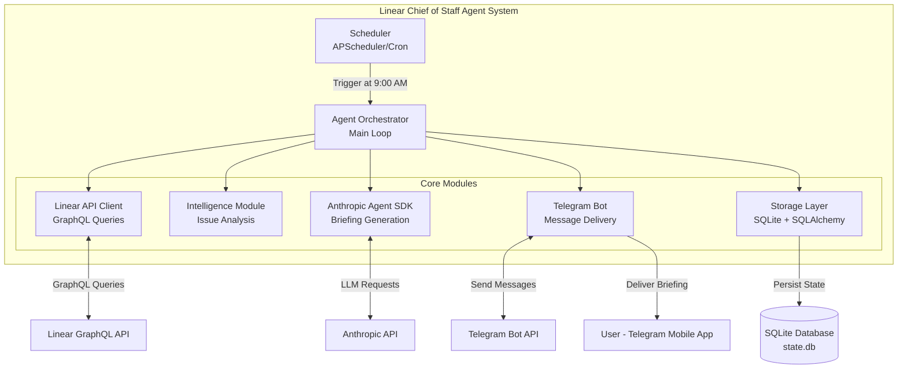
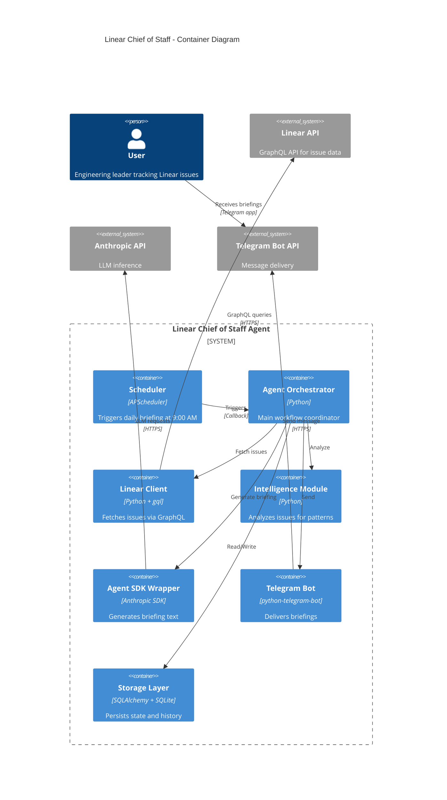
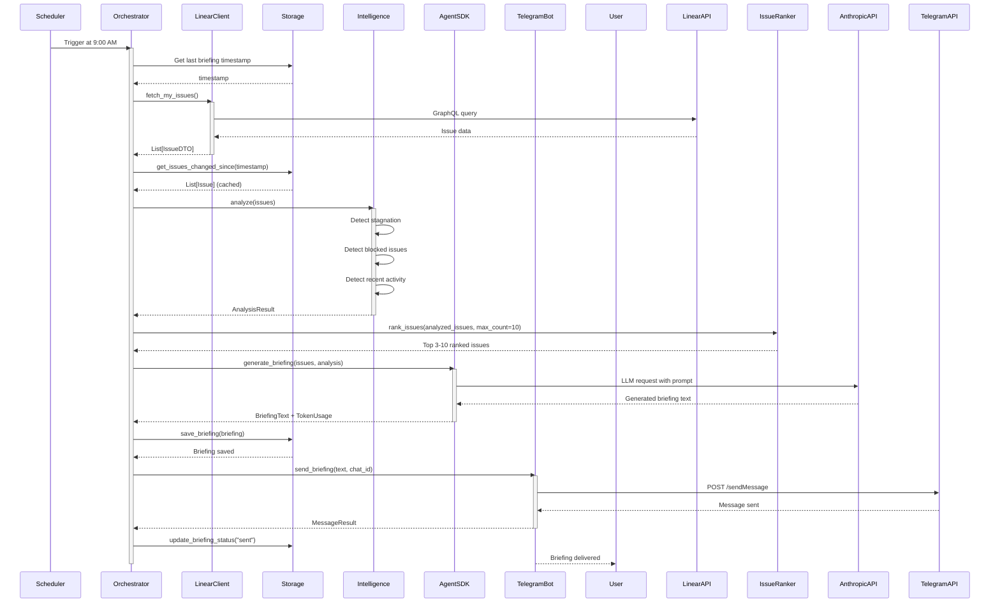
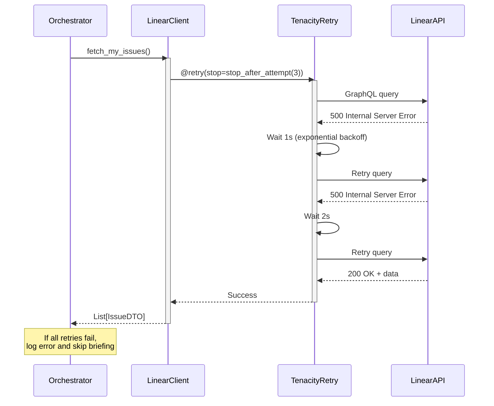

# Linear Chief of Staff Architecture Document

## Introduction

This document outlines the overall project architecture for Linear Chief of Staff, including backend systems, shared services, and non-UI specific concerns. Its primary goal is to serve as the guiding architectural blueprint for AI-driven development, ensuring consistency and adherence to chosen patterns and technologies.

**Relationship to Frontend Architecture:**
Not applicable - this project has no traditional frontend. User interface is provided through Telegram Bot API (third-party service).

### Starter Template or Existing Project

**N/A - Greenfield project**

This is a greenfield Python project built from scratch. No starter templates or existing codebases are used. The architecture is designed specifically for autonomous agent patterns using Anthropic's Agent SDK.

### Change Log

| Date | Version | Description | Author |
|------|---------|-------------|--------|
| 2025-01-30 | 0.1 | Initial architecture from PRD | Winston (Architect Agent) |

---

## High Level Architecture

### Technical Summary

Linear Chief of Staff is a **monolithic Python agent system** built on Anthropic's Agent SDK for autonomous monitoring and intelligence briefing generation. The system runs as a single async Python process that periodically fetches Linear issues via GraphQL API, analyzes them using LLM reasoning, and delivers structured briefings via Telegram. State persistence uses SQLite for issue tracking and briefing history. The architecture emphasizes **learning and experimentation** over production-scale optimization, with focus on understanding Agent SDK patterns, cost modeling, and autonomous operation.

### High Level Overview

**Architecture Style:** Monolithic Python Agent System
**Repository:** Monorepo (single repo for all code, docs, and config)
**Deployment:** Local development first, future cloud deployment via systemd service

**Core Flow:**
1. **Scheduler** triggers briefing generation at 9:00 AM daily (APScheduler or Agent SDK native)
2. **Linear Client** fetches watched/assigned issues via GraphQL API
3. **Intelligence Module** analyzes issues for stagnation, blocking, and activity patterns
4. **Agent SDK** generates natural language briefing with issue summaries
5. **Telegram Bot** delivers briefing to user's Telegram chat
6. **Storage Layer** persists issue states and briefing history in SQLite

**Key Architectural Decisions:**
- **Monolith over microservices:** Single-user learning project doesn't warrant distributed complexity
- **SQLite over PostgreSQL:** File-based DB simplifies local development and deployment
- **Async/await:** Python asyncio for concurrent API calls without threading complexity
- **Agent SDK as orchestrator:** Primary intelligence layer, not just an API wrapper
- **Local-first:** Run on local machine before cloud deployment to accelerate learning

### High Level Project Diagram



### Architectural and Design Patterns

- **Repository Pattern:** Abstract SQLite data access behind clean interfaces - _Rationale:_ Enables testing with mock repos and future database migration if needed
- **Async/Await Pattern:** Python asyncio for non-blocking I/O - _Rationale:_ Concurrent API calls (Linear + Anthropic + Telegram) without thread complexity
- **Retry with Exponential Backoff:** Use `tenacity` library for resilient API calls - _Rationale:_ Handle transient failures gracefully without manual retry logic
- **Strategy Pattern for Scheduling:** Abstract scheduler interface (APScheduler or Agent SDK native) - _Rationale:_ Week 1 spike will determine best approach, design supports both
- **Facade Pattern for Agent SDK:** Wrap Agent SDK calls behind `BriefingAgent` interface - _Rationale:_ Isolate SDK-specific details, simplify testing with mocks
- **Template Method for Intelligence Analysis:** Base `IssueAnalyzer` with concrete implementations (`StagnationAnalyzer`, `BlockedIssueDetector`) - _Rationale:_ Extensible analysis logic without modifying orchestrator

---

## Tech Stack

### Cloud Infrastructure

**Note:** MVP runs locally before cloud deployment. Cloud infrastructure is **future consideration** only.

- **Provider:** None for MVP (local machine). Future: Digital Ocean Droplet or AWS EC2 t3.small
- **Key Services:** Systemd (process management), environment variables (secrets)
- **Deployment Regions:** N/A for MVP. Future: US-East-1 or closest region

### Technology Stack Table

| Category | Technology | Version | Purpose | Rationale |
|----------|-----------|---------|---------|-----------|
| **Language** | Python | 3.11+ | Primary development language | Modern type hints, async/await, Agent SDK support |
| **Runtime** | CPython | 3.11+ | Python interpreter | Standard implementation, best compatibility |
| **Agent Framework** | Anthropic Agent SDK | Latest | Core intelligence and briefing generation | Primary learning objective, handles LLM reasoning |
| **Linear API Client** | `gql` or Linear Python SDK | TBD (Week 1) | GraphQL queries to Linear | Decision pending SDK quality research |
| **Telegram Bot** | `python-telegram-bot` | 20.x | Telegram Bot API integration | Mature, well-documented, async support |
| **HTTP Client** | `httpx` | 0.26.x | Async HTTP requests | Modern async client, better than requests for concurrent calls |
| **Database** | SQLite | 3.x | Local state persistence | File-based, no server, perfect for single-user MVP |
| **ORM** | SQLAlchemy | 2.0+ | Database abstraction | Type-safe, supports migrations, async support |
| **Scheduler** | APScheduler | 3.10.x | Scheduled task execution | Fallback if Agent SDK lacks native scheduling |
| **Config Management** | python-decouple | 3.8+ | Environment variable management | Separates config from code, `.env` support |
| **Logging** | python-json-logger | 2.0.x | Structured JSON logging | Parseable logs for analysis and debugging |
| **Retry Logic** | tenacity | 8.2.x | Exponential backoff retries | Handles transient API failures gracefully |
| **Type Checking** | mypy | 1.8.x | Static type validation | Catch type errors before runtime |
| **Code Formatter** | black | 24.x | Code formatting | Consistent style, zero configuration |
| **Testing Framework** | pytest | 8.x | Unit and integration tests | Most popular Python test framework, great plugins |
| **Test Coverage** | pytest-cov | 4.x | Coverage reporting | Tracks test coverage metrics |
| **Mocking Library** | pytest-mock | 3.12.x | Test mocking | Simplifies mocking in pytest |
| **Async Testing** | pytest-asyncio | 0.23.x | Async test support | Run async tests in pytest |
| **Dependency Management** | poetry | 1.7.x | Reproducible builds | Better than pip, lockfile support, virtual envs |
| **CI/CD** | GitHub Actions | N/A | Automated testing (future) | Free, integrated with GitHub |
| **Deployment** | systemd | System default | Process management (future) | Standard Linux service manager |
| **Embeddings** | sentence-transformers | 2.x | Generate semantic embeddings for Linear issues | Enables semantic search and preference learning (all-MiniLM-L6-v2 model) |
| **Memory Layer** | mem0 | Latest | Persistent agent memory and user preference learning | Replaces custom DB-based context, provides memory graph for tracking user interactions and preferences |
| **Vector Store** | ChromaDB | 0.4.x | Store and search issue embeddings | Lightweight vector DB for similarity search (alternative: pgvector if migrating to PostgreSQL) |

---

## Data Models

### Issue

**Purpose:** Represents a Linear issue being tracked by the agent. Stores metadata needed for stagnation detection and change tracking.

**Key Attributes:**
- `linear_id`: string - Linear's unique issue identifier (e.g., "ENG-123")
- `title`: string - Issue title
- `state`: string - Current state (e.g., "In Progress", "Done", "Blocked")
- `assignee_id`: string (nullable) - Linear user ID of assignee
- `labels`: JSON array - Issue labels (e.g., ["Blocked", "High Priority"])
- `updated_at`: datetime - Last update timestamp from Linear
- `last_seen_at`: datetime - When our agent last processed this issue
- `description`: text (nullable) - Issue description (truncated for token limits)
- `created_at`: datetime - When record was created in our DB

**Relationships:**
- One issue can appear in multiple briefings (one-to-many with `Briefing` via junction table)

### Briefing

**Purpose:** Tracks generated briefings for cost analysis, debugging, and historical reference.

**Key Attributes:**
- `id`: integer - Primary key
- `generated_at`: datetime - When briefing was created
- `issue_count`: integer - Number of issues included in briefing
- `tokens_used`: integer - Total tokens consumed by Anthropic API
- `cost_usd`: decimal - Estimated cost in USD
- `telegram_message_id`: string (nullable) - Telegram message ID if delivered
- `delivery_status`: enum - "pending", "sent", "failed"
- `error_message`: text (nullable) - Error details if delivery failed

**Relationships:**
- Many-to-many with `Issue` (briefing can include multiple issues, issue can appear in multiple briefings)

---

## Components

### Linear API Client

**Responsibility:** Fetch issues from Linear GraphQL API with pagination, rate limiting, and error handling.

**Key Interfaces:**
- `async def fetch_my_issues() -> List[IssueDTO]` - Retrieve all watched/assigned issues
- `async def authenticate() -> UserInfo` - Validate API key and get user info
- `async def get_issue_updates(since: datetime) -> List[IssueDTO]` - Fetch only changed issues

**Dependencies:**
- `httpx` for async HTTP/GraphQL requests (**locked-in decision**)
- `python-decouple` for API key configuration
- `tenacity` for retry logic

**Technology Stack:** Python 3.11, async/await, httpx for hand-written GraphQL queries

**Design Decision:** Using `httpx` with hand-written queries instead of `gql` library or Linear SDK. Rationale: Simpler mocking in tests, fewer runtime dependencies, more control over query structure for a lean monolith.

### Intelligence Module

**Responsibility:** Analyze issues to detect patterns (stagnation, blocking, momentum) using rule-based heuristics.

**Key Interfaces:**
- `class IssueAnalyzer` (abstract base)
  - `def analyze(issues: List[Issue]) -> AnalysisResult`
- `class StagnationAnalyzer(IssueAnalyzer)` - Detects issues with no updates for 3+ days
- `class BlockedIssueDetector(IssueAnalyzer)` - Identifies explicitly blocked issues
- `class ActivityAnalyzer(IssueAnalyzer)` - Finds recently active issues

**Dependencies:**
- Data models (`Issue`)
- Python standard library (`datetime`, `typing`)

**Technology Stack:** Pure Python logic, no external dependencies

### IssueRanker

**Responsibility:** Rank and filter analyzed issues to cap briefing at 3-10 most relevant items (FR14).

**Key Interfaces:**
- `class IssueRanker`
  - `def rank_issues(issues: List[Issue], analysis: AnalysisResult, max_count: int = 10) -> List[Issue]`

**Scoring Algorithm:**
- Blocked issues: 10 points
- Stale issues (no updates 3+ days): 5 points
- Recent activity: 3 points
- Age per week: 1 point
- Final ranking: Issues sorted by total score descending, return top `max_count` items

**Dependencies:**
- `AnalysisResult` from Intelligence Module
- Data models (`Issue`)
- Python standard library (`datetime`, `typing`, `heapq`)

**Technology Stack:** Pure Python logic

### Anthropic Agent SDK Integration

**Responsibility:** Generate natural language briefings from analyzed issue data using LLM reasoning.

**Key Interfaces:**
- `class BriefingAgent` (facade for Agent SDK)
  - `async def generate_briefing(issues: List[Issue], analysis: AnalysisResult) -> BriefingText`
  - `def get_token_usage() -> TokenUsageStats`

**Dependencies:**
- Anthropic Agent SDK (primary)
- Issue data models
- Prompt templates (stored in code or config)

**Technology Stack:** Anthropic Agent SDK, Python 3.11, async/await

**Prompt Length Constraints (FR6):**
- Prompt template MUST enforce 1-2 sentence summaries per issue
- Example instruction: "Summarize each issue in maximum 2 sentences (200 characters). Focus on current status and next action needed."
- **Validation:** Unit tests assert response length <200 chars per issue summary. Test fails if Agent SDK generates longer summaries.
- Fallback: If summary exceeds limit, truncate to 200 chars + "..." (handled in `BriefingAgent._validate_summary_length()`)

### SemanticSearch & Learning Memory

**Responsibility:** Full-featured persistent memory and preference learning using mem0. Agent learns from all interactions to personalize briefings and responses.

**Key Interfaces:**
- `class SemanticIssueIndex`
  - `async def index_issue(issue: Issue) -> None` - Generate and store embedding for issue
  - `async def search_similar(query: str, top_k: int = 10) -> List[Issue]` - Semantic similarity search
  - `async def find_related(issue_id: str) -> List[Issue]` - Find issues related to given issue

- `class PreferenceLearner` (uses mem0)
  - `async def observe_interaction(issue_id: str, action: str, context: Dict) -> None` - Track user engagement
  - `async def get_user_interests() -> PreferenceProfile` - Retrieve learned preferences
  - `async def get_agent_context(days: int = 7) -> AgentMemory` - Retrieve recent briefing history and narrative

- `class FeedbackTracker`
  - `async def record_feedback(issue_id: str, feedback: Literal["relevant", "irrelevant"]) -> None` - Track Telegram inline button clicks
  - `async def get_feedback_stats() -> Dict[str, float]` - Retrieve feedback metrics for learning

**Dependencies:**
- `mem0` - Persistent memory layer for agent context and user preferences
- `sentence-transformers` - Generate embeddings for Linear issue content (all-MiniLM-L6-v2 model)
- `chromadb` - Vector database for similarity search and semantic queries

**Technology Stack:** Python, mem0, sentence-transformers, ChromaDB, numpy

**Learning Capabilities:**
1. **Agent Context Memory:**
   - Stores last 7 days of briefing narratives
   - Tracks which issues were flagged and why
   - Enables continuity: "Yesterday I said ENG-123 was stale, today it's STILL stale → escalate"

2. **User Preference Learning:**
   - Topics: backend (40%), API (30%), frontend (20%), infra (10%)
   - Teams: most engaged with @api-team, @backend-team
   - Labels: prioritizes "security", "performance" over "nice-to-have"
   - Historical patterns: user reads blocked issues first, skips documentation tasks

3. **Interaction Tracking:**
   - Telegram queries: "What's blocked?" → learns user cares about blockers
   - Inline feedback: 👍/👎 per issue → refines relevance scoring
   - Read receipts: which issues user actually opened in Linear → implicit feedback
   - Conversation history: maintains context across multi-turn dialogues

4. **Semantic Search:**
   - Find similar issues based on embeddings
   - "Show me issues like ENG-123" → returns semantically similar issues
   - Cluster analysis: group related issues automatically
   - Duplicate detection: flag potential duplicates

**Integration with Agent SDK:**
- mem0 context passed to Claude as system prompt: "User preferences: [mem0 data]"
- Agent uses preferences to re-rank IssueRanker output
- Agent tailors language based on user history (technical vs. managerial tone)
- Agent remembers unresolved follow-ups: "Last week you asked about X, here's the update"

**Data Storage:**
- mem0 memory graph: stores all memories with timestamps and relationships
- ChromaDB: stores issue embeddings (384-dim vectors from sentence-transformers)
- SQLite: stores feedback data (`issue_feedback` table with ratings)

**Example Flow:**
```python
# Morning briefing generation
agent_memory = mem0.get_agent_context(days=7)
user_prefs = mem0.get_user_interests()

# Agent sees:
# - "Yesterday flagged ENG-123 as stale (4 days)"
# - "User engages with backend issues 2x more than frontend"
# - "User gave 👍 to security-labeled issues last 3 times"

# Agent adjusts:
# - Prioritizes backend issues higher
# - Flags security issues even if not top-ranked
# - Continues narrative: "ENG-123 still stale, now 5 days"
```

**Configuration:**
- `MEM0_API_KEY` - mem0 API key (if using hosted)
- `CHROMADB_PATH` - ChromaDB persistence directory (default: `~/.linear_chief/chromadb`)
- `EMBEDDING_MODEL` - sentence-transformers model (default: `all-MiniLM-L6-v2`)

### Telegram Bot

**Responsibility:** Deliver briefings to user via Telegram Bot API with message formatting and chunking.

**Key Interfaces:**
- `async def send_briefing(text: str, chat_id: str) -> MessageResult`
- `async def send_chunked_message(text: str, chat_id: str, max_length: int = 4096)`

**Dependencies:**
- `python-telegram-bot` library
- `python-decouple` for bot token
- Telegram Bot API (external)

**Technology Stack:** python-telegram-bot 20.x, async/await

### CostTracker

**Responsibility:** Track and report token usage and Anthropic API costs for learning analysis.

**Key Interfaces:**
- `class CostTracker`
  - `def log_token_usage(tokens: int, operation: str)` - Record token consumption for an operation
  - `def get_daily_cost() -> CostReport` - Retrieve cost metrics for current day with token counts and estimated API costs
  - `def cli_metrics_dashboard() -> str` - Generate formatted metrics dashboard for CLI output

**CLI Command:**
- `python -m linear_chief.cli metrics` - Display token usage and cost dashboard

**Storage:**
- Append to `briefings` table with cost metadata, or separate `cost_logs` table with structure:
  - `id`, `timestamp`, `operation`, `token_count`, `estimated_cost_usd`

**Technology Stack:** Python, SQLite, `rich` library for CLI table formatting

### Storage Layer

**Responsibility:** Persist and retrieve issue states and briefing history using SQLite + SQLAlchemy ORM. Also maintains agent context for continuity across briefing cycles.

**Key Interfaces:**
- `class IssueRepository`
  - `async def save_issues(issues: List[Issue])`
  - `async def get_issues_changed_since(timestamp: datetime) -> List[Issue]`
  - `async def mark_issue_seen(issue_id: str, timestamp: datetime)`
- `class BriefingRepository`
  - `async def save_briefing(briefing: Briefing)`
  - `async def get_recent_briefings(days: int = 7) -> List[Briefing]`
  - `async def save_agent_context(briefing_id: int, context: Dict)` - Store agent memory (last briefing narrative, follow-up flags)

**Agent Context Persistence:**
- **Purpose:** Preserve agent reasoning and follow-up flags across briefing cycles to prevent memory loss from Agent SDK session resets
- **Database Field:** Add `agent_context` JSON column to `briefings` table
- **Contents:** Last briefing narrative, unresolved follow-up flags, contextual notes for next cycle

**Dependencies:**
- SQLAlchemy 2.0+ (async engine)
- SQLite 3.x
- Data models (`Issue`, `Briefing`)

**Technology Stack:** SQLAlchemy (async), SQLite, Python 3.11

### Scheduler

**Responsibility:** Trigger briefing generation at scheduled time (9:00 AM daily in user's local timezone).

**Key Interfaces:**
- `class BriefingScheduler` (concrete implementation, not interface)
  - `def schedule_daily(time: str, timezone: str, callback: Callable)`
  - `def start()`
  - `def stop()`

**Dependencies:**
- **APScheduler 3.10.x** (primary scheduler - LOCKED-IN DECISION)
- `pytz` for timezone handling
- Orchestrator callback function

**Technology Stack:** APScheduler with CronTrigger, Python asyncio

**Design Decision:** APScheduler is the **primary** scheduling mechanism. Anthropic Agent SDK native scheduling (if available) is a **stretch goal** for future optimization, NOT a week-1 requirement. This de-risks the MVP and ensures we can proceed with Epics 2-3 regardless of Agent SDK capabilities.

**Timezone Handling:**
- User configures `LOCAL_TIMEZONE` in `.env` (e.g., "America/New_York", "Europe/Prague")
- Scheduler uses `pytz` to convert to system time
- DST transitions handled automatically by pytz
- Test suite includes DST boundary test cases

**Contingency Plan (if Agent SDK spike fails):**
- Fallback: Use APScheduler + plain Claude Messages API (not Agent SDK)
- Cron wrapper alternative: systemd timer + Python script
- Both options validated in Week 1 spike

### Component Diagrams



---

## External APIs

### Linear GraphQL API

- **Purpose:** Fetch issues assigned to or watched by the authenticated user
- **Documentation:** https://developers.linear.app/docs/graphql/working-with-the-graphql-api
- **Base URL(s):** `https://api.linear.app/graphql`
- **Authentication:** Personal API key (header: `Authorization: Bearer <token>`) or OAuth2 (future)
- **Rate Limits:** 100 requests per minute per API key (to be validated in Week 1 spike - Linear API docs were inaccessible during architecture phase)

**Key Endpoints Used:**
- `POST /graphql` - Main query endpoint
  - Query: `viewer { assignedIssues { nodes { id title state updatedAt labels { name } } } }`
  - Query: `issues(filter: { subscribers: { id: { eq: $userId } } })`

**Integration Notes:**
- Use pagination cursors for 50+ issues (`after` parameter)
- Implement request batching where possible to minimize API calls
- Cache responses for 5 minutes to avoid redundant queries
- Exponential backoff on 429 (rate limit) responses

### Anthropic API

- **Purpose:** Generate natural language briefing summaries using Claude via Agent SDK
- **Documentation:** https://docs.anthropic.com/claude/reference
- **Base URL(s):** Handled by Agent SDK (abstracts API details)
- **Authentication:** API key via `ANTHROPIC_API_KEY` environment variable
- **Rate Limits:** TBD (typically tier-based, should be sufficient for single user)

**Key Endpoints Used:**
- Agent SDK abstracts direct API calls
- Underlying: `/v1/messages` (Claude Messages API)

**Integration Notes:**
- Track token usage for cost monitoring (aim for <$100/month)
- Use prompt caching if Agent SDK supports it (reduce costs for repeated issue data)
- Set max_tokens limit to prevent runaway costs (e.g., 1000 tokens per briefing)
- Implement timeout (30s) to prevent hanging requests

### Telegram Bot API

- **Purpose:** Deliver briefing messages to user's Telegram chat
- **Documentation:** https://core.telegram.org/bots/api
- **Base URL(s):** `https://api.telegram.org/bot<token>/`
- **Authentication:** Bot token in URL path
- **Rate Limits:** 30 messages per second (not a concern for single user)

**Key Endpoints Used:**
- `POST /sendMessage` - Send text message to chat
  - Parameters: `chat_id`, `text`, `parse_mode: "Markdown"`

**Integration Notes:**
- Message length limit: 4096 characters (chunk long briefings)
- Use Markdown formatting for readability (**bold**, `code`, etc.)
- Retry on network errors (tenacity with max 3 retries)
- No need for webhooks (we only send, not receive messages)

---

## Core Workflows

### Daily Briefing Generation Workflow



### Error Handling in API Calls



### Workflow Optimization

**Optimization (Epic 3.3):** Workflow uses `get_issues_changed_since(last_briefing_timestamp)` to fetch only changed issues from storage, reducing token consumption. Only delta issues are sent to Agent SDK, not full 50-issue list.

---

## Database Schema

**SQLite Configuration:**
```sql
-- Enable WAL mode for concurrency (prevents locking issues with APScheduler + manual CLI)
PRAGMA journal_mode=WAL;
PRAGMA synchronous=NORMAL;
```

```sql
-- Issues table
CREATE TABLE issues (
    linear_id TEXT PRIMARY KEY,
    title TEXT NOT NULL,
    state TEXT NOT NULL,
    assignee_id TEXT,
    labels TEXT,  -- JSON array
    updated_at DATETIME NOT NULL,
    last_seen_at DATETIME NOT NULL,
    description TEXT,
    created_at DATETIME NOT NULL DEFAULT CURRENT_TIMESTAMP,
    INDEX idx_updated_at (updated_at),
    INDEX idx_last_seen_at (last_seen_at)
);

-- Briefings table
CREATE TABLE briefings (
    id INTEGER PRIMARY KEY AUTOINCREMENT,
    generated_at DATETIME NOT NULL,
    issue_count INTEGER NOT NULL,
    tokens_used INTEGER NOT NULL,
    cost_usd DECIMAL(10, 4) NOT NULL,
    telegram_message_id TEXT,
    delivery_status TEXT NOT NULL CHECK(delivery_status IN ('pending', 'sent', 'failed', 'permanently_failed')),
    error_message TEXT,
    agent_context TEXT,  -- JSON: {narrative, follow_up_flags, notes}
    created_at DATETIME NOT NULL DEFAULT CURRENT_TIMESTAMP,
    INDEX idx_generated_at (generated_at)
);

-- Briefing-Issue junction table (many-to-many)
CREATE TABLE briefing_issues (
    briefing_id INTEGER NOT NULL,
    issue_linear_id TEXT NOT NULL,
    PRIMARY KEY (briefing_id, issue_linear_id),
    FOREIGN KEY (briefing_id) REFERENCES briefings(id) ON DELETE CASCADE,
    FOREIGN KEY (issue_linear_id) REFERENCES issues(linear_id) ON DELETE CASCADE
);
```

---

## Source Tree

```plaintext
linear-chief-of-staff/
├── .github/
│   └── workflows/
│       └── ci.yaml                 # GitHub Actions CI (future)
├── src/
│   └── linear_chief/
│       ├── __init__.py
│       ├── __main__.py             # CLI entry point (python -m linear_chief)
│       ├── config.py               # Configuration from .env (decouple)
│       ├── orchestrator.py         # Main briefing workflow
│       ├── agent/
│       │   ├── __init__.py
│       │   ├── briefing_agent.py   # Anthropic Agent SDK wrapper
│       │   └── prompts.py          # Prompt templates
│       ├── linear/
│       │   ├── __init__.py
│       │   ├── client.py           # Linear API client
│       │   ├── models.py           # IssueDTO data transfer objects
│       │   └── queries.py          # GraphQL query strings
│       ├── telegram/
│       │   ├── __init__.py
│       │   └── bot.py              # Telegram bot wrapper
│       ├── intelligence/
│       │   ├── __init__.py
│       │   ├── analyzers.py        # Issue analysis logic
│       │   └── types.py            # AnalysisResult types
│       ├── storage/
│       │   ├── __init__.py
│       │   ├── database.py         # SQLAlchemy engine setup
│       │   ├── models.py           # SQLAlchemy ORM models
│       │   └── repositories.py     # Repository pattern implementations
│       ├── scheduling/
│       │   ├── __init__.py
│       │   ├── scheduler.py        # Scheduler interface
│       │   └── apscheduler_impl.py # APScheduler implementation
│       └── utils/
│           ├── __init__.py
│           ├── logging_config.py   # JSON logger setup
│           └── retry.py            # Tenacity retry decorators
├── tests/
│   ├── __init__.py
│   ├── unit/
│   │   ├── test_intelligence.py
│   │   ├── test_briefing_agent.py
│   │   └── test_repositories.py
│   ├── integration/
│   │   ├── test_linear_client.py   # Mocked Linear API
│   │   ├── test_telegram_bot.py    # Mocked Telegram API
│   │   └── test_end_to_end.py      # Full workflow mock
│   └── fixtures/
│       └── sample_issues.json      # Test data
├── docs/
│   ├── brief.md
│   ├── prd/
│   │   └── (sharded PRD files)
│   └── architecture.md             # This file
├── scripts/
│   ├── setup_db.py                 # Initialize SQLite schema
│   └── manual_briefing.py          # CLI tool for manual trigger
├── .env.example                    # Environment variable template
├── .gitignore
├── pyproject.toml                  # Poetry dependency management
├── poetry.lock                     # Locked dependencies
├── pytest.ini                      # Pytest configuration
├── mypy.ini                        # Mypy type checking config
└── README.md
```

---

## Infrastructure and Deployment

### Infrastructure as Code

- **Tool:** Not applicable for MVP (manual setup)
- **Location:** `scripts/` directory for setup scripts
- **Approach:** Manual configuration, systemd service file for future deployment

### Deployment Strategy

- **Strategy:** Manual deployment for MVP. Future: systemd service on Ubuntu 22.04 LTS
- **CI/CD Platform:** GitHub Actions (future) - run tests on push, no auto-deploy for now
- **Pipeline Configuration:** `.github/workflows/ci.yaml` (not implemented in MVP)

### Environments

- **Development:** Local machine (macOS/Linux) - `~/.linear_chief/state.db`
- **Production (future):** Digital Ocean Droplet or AWS EC2 t3.small - `/var/lib/linear_chief/state.db`

### Environment Promotion Flow

```
Development (local) → Manual testing (7 days) → Production deployment (systemd service)
```

### Rollback Strategy

- **Primary Method:** Git revert + redeploy (future cloud deployment)
- **Trigger Conditions:** Briefing failures, API errors, cost overruns
- **Recovery Time Objective:** 5 minutes (stop service, revert code, restart)

### Monitoring and Alerting

- **Missed Briefing Detection:** Watchdog process checks last briefing timestamp every hour. If >25 hours since last briefing, trigger alert.
- **Alert Channels:**
  - Primary: Telegram message to user's chat (fallback channel)
  - Secondary: Log to stderr with ERROR level (monitored by systemd journal)
- **Catch-up Plan:** Missed briefings are requeued automatically. Orchestrator checks `last_briefing_timestamp` on startup and generates catch-up briefing if >24h gap.
- **Uptime Target:** 99% (max 1 missed briefing per 100 days = 7.2 hours downtime/year)
- **Health Check Endpoint:** HTTP endpoint `:8000/health` returns last briefing timestamp (future: for external monitoring)

### Backup and Restore

- **Backup Frequency:** Daily SQLite file backup to `~/.linear_chief/backups/state-{date}.db`
- **Retention Policy:** Keep 7 daily backups, 4 weekly backups (28 days total)
- **Backup Script:** `scripts/backup_db.py` run via cron
- **Restore Procedure:** Stop service, copy backup to `state.db`, restart service
- **Data Retention:** Issue metadata retained for 30 days, briefings retained indefinitely (for cost analysis)

---

## Error Handling Strategy

### General Approach

- **Error Model:** Exception-based with custom exception hierarchy
- **Exception Hierarchy:**
  - `LinearChiefError` (base)
    - `LinearAPIError` (Linear API failures)
    - `TelegramDeliveryError` (Telegram send failures)
    - `BriefingGenerationError` (Agent SDK failures)
    - `StorageError` (SQLite errors)
- **Error Propagation:** Exceptions bubble up to orchestrator, which logs and decides whether to retry or skip briefing

### Logging Standards

- **Library:** `python-json-logger` 2.0.x
- **Format:** JSON with structured fields for parsing
- **Levels:**
  - DEBUG: API request/response details (masked secrets)
  - INFO: Briefing generation start/completion, token usage
  - WARNING: Retries, rate limit warnings
  - ERROR: Failed API calls after retries, briefing failures
- **Required Context:**
  - Correlation ID: UUID per briefing generation (tracks full workflow)
  - Service Context: Module name, function name
  - User Context: User ID (Linear user ID, not PII)

**Example Log Entry:**
```json
{
  "timestamp": "2025-01-30T09:00:15.123Z",
  "level": "INFO",
  "correlation_id": "550e8400-e29b-41d4-a716-446655440000",
  "module": "linear_chief.orchestrator",
  "event": "briefing_generated",
  "issue_count": 8,
  "tokens_used": 1234,
  "cost_usd": 0.05,
  "duration_ms": 2500
}
```

### Error Handling Patterns

#### External API Errors

- **Retry Policy:** Exponential backoff (1s, 2s, 4s) with max 3 attempts (tenacity library)
- **Circuit Breaker:** Not implemented for MVP (single user, low volume)
- **Timeout Configuration:** 30s per API call
- **Error Translation:** Map HTTP status codes to custom exceptions
  - 429 (rate limit) → Wait and retry
  - 4xx (client error) → Log and fail (no retry)
  - 5xx (server error) → Retry with backoff

**Alert Hooks:**
- If all retries exhausted for critical operations (Linear API, Anthropic API), trigger alert hooks:
  - Send Telegram message: "⚠️ Briefing generation failed: {error_summary}. Check logs."
  - Log ERROR with correlation_id for debugging
- Missed briefings are requeued for next hour (max 3 requeue attempts)
- After 3 failed attempts, alert user and mark briefing as "permanently_failed"

#### Business Logic Errors

- **Custom Exceptions:** `StagnationDetectionError`, `InvalidIssueDataError`
- **User-Facing Errors:** Telegram message: "⚠️ Briefing generation failed. Check logs."
- **Error Codes:** Simple enum: `LINEAR_API_FAIL`, `TELEGRAM_SEND_FAIL`, `AGENT_SDK_TIMEOUT`

#### Data Consistency

- **Transaction Strategy:** SQLAlchemy transactions for atomic briefing saves
- **Compensation Logic:** If Telegram delivery fails after DB save, mark briefing status as "failed"
- **Idempotency:** Briefing generation is idempotent (re-running produces same result for same timestamp)

---

## Coding Standards

### Core Standards

- **Languages & Runtimes:** Python 3.11+, no Python 2 compatibility needed
- **Style & Linting:**
  - Use `black` for code formatting (line length: 100)
  - Use `mypy` for type checking with strict mode
  - Use `ruff` for fast linting (replaces flake8, isort)
- **Test Organization:** Tests mirror src structure (`tests/unit/`, `tests/integration/`)

### Naming Conventions

| Element | Convention | Example |
|---------|-----------|---------|
| Modules | snake_case | `briefing_agent.py` |
| Classes | PascalCase | `BriefingAgent` |
| Functions/Methods | snake_case | `generate_briefing()` |
| Constants | UPPER_SNAKE_CASE | `MAX_TOKEN_LIMIT` |
| Private methods | _leading_underscore | `_build_prompt()` |
| Async functions | snake_case with async prefix | `async def fetch_issues()` |

### Critical Rules

- **Never use `print()` in production code:** Use `logger.info()` or `logger.debug()` from `logging` module
- **All async functions must be awaited or run in event loop:** No forgetting `await` keyword
- **External API calls must use retry decorator:** `@retry(stop=stop_after_attempt(3), wait=wait_exponential())`
- **No secrets in code:** Use `config.py` to load from environment variables
- **All public functions must have type hints:** `def foo(bar: str) -> int:`
- **Database queries must use SQLAlchemy ORM:** Never raw SQL strings (SQL injection risk)
- **Telegram message length must be validated:** Chunk messages >4096 chars
- **All exceptions must be logged before raising:** `logger.error("...", exc_info=True)` before `raise`
- **All public modules, classes, and functions MUST have docstrings:** Use Google-style docstrings with Args, Returns, Raises sections (enforced by `pydocstyle` linter)
- **Docstring coverage target: 100% for public APIs:** Use `interrogate` tool to measure coverage (fail CI if <100%)

---

## Test Strategy and Standards

### Testing Philosophy

- **Approach:** Test-after (write tests for each story's acceptance criteria after implementation)
- **Coverage Goals:** 80%+ unit test coverage, 60%+ integration test coverage
- **Performance SLA:** 30s end-to-end briefing generation (instrumented per-stage)
- **Test Pyramid:**
  - 70% unit tests (fast, isolated)
  - 25% integration tests (mocked external APIs)
  - 5% manual end-to-end tests (Telegram delivery)

### Test Types and Organization

#### Unit Tests

- **Framework:** pytest 8.x
- **File Convention:** `test_<module_name>.py` (e.g., `test_briefing_agent.py`)
- **Location:** `tests/unit/`
- **Mocking Library:** pytest-mock (fixtures + mocker)
- **Coverage Requirement:** 80%+ for core logic modules (intelligence, agent, repositories)

**AI Agent Requirements:**
- Generate tests for all public methods and classes
- Cover edge cases: empty issue list, no changed issues, API errors
- Follow AAA pattern (Arrange, Act, Assert)
- Mock all external dependencies (Agent SDK, Linear API, Telegram API)

#### Integration Tests

- **Scope:** Test interactions between modules with mocked external APIs
- **Location:** `tests/integration/`
- **Test Infrastructure:**
  - **Linear API:** Mock HTTP responses using `pytest-httpx`
  - **Anthropic API:** Mock Agent SDK responses (fixture-based)
  - **Telegram API:** Mock `python-telegram-bot` with pytest-mock
  - **SQLite:** Use in-memory database (`:memory:`) for fast tests

#### End-to-End Tests

- **Framework:** Manual testing for MVP (no automation)
- **Scope:** Full workflow from scheduler trigger to Telegram delivery
- **Environment:** Local development machine
- **Test Data:** Use separate test Telegram bot and Linear workspace (or mock Linear responses)

#### Performance Tests

- **Framework:** pytest with timing fixtures
- **Scope:** End-to-end briefing generation (Linear fetch → Agent SDK → Telegram)
- **SLA Target:** 30 seconds for ≤50 issues (NFR1)
- **Instrumentation:**
  - Measure each stage: Linear API (budget: 5s), Intelligence (budget: 2s), Agent SDK (budget: 20s), Telegram (budget: 3s)
  - Regression tests assert total time < 30s
  - Log timing data to cost_logs table for analysis
- **Test Data:** Use 50-issue fixture with realistic content
- **Run Frequency:** Every commit (GitHub Actions)

### Test Data Management

- **Strategy:** Fixture-based test data (JSON files in `tests/fixtures/`)
- **Fixtures:** `sample_issues.json`, `sample_briefing.json`
- **Factories:** Not needed for MVP (fixtures are sufficient)
- **Cleanup:** pytest fixtures with `yield` for setup/teardown

### Continuous Testing

- **CI Integration:** GitHub Actions (future) - run pytest on every push
- **Performance Tests:** Not implemented for MVP (single user, low volume)
- **Security Tests:** Dependency scanning with `safety` library (future)

---

## Security

### Input Validation

- **Validation Library:** Pydantic (for DTO models)
- **Validation Location:** At API boundary (Linear client, config loading)
- **Required Rules:**
  - All environment variables must be validated on startup (missing API keys → fail fast)
  - Linear issue data must be sanitized (strip HTML, limit description length)
  - Telegram message content must escape Markdown special chars

### Authentication & Authorization

- **Auth Method:** API key-based for all external services (no OAuth for MVP)
- **Session Management:** N/A (no user sessions, agent runs as single user)
- **Required Patterns:**
  - API keys loaded from environment variables only
  - Never log API keys (mask in logs: `LINEAR_API_KEY=sk-***...***`)

### Secrets Management

- **Development:** `.env` file (gitignored) loaded via `python-decouple`
- **Production (Phase 1 - systemd):** Environment variables set in systemd service file (`/etc/systemd/system/linear-chief.service`)
- **Production (Phase 2 - cloud):** Migrate to OS keychain (macOS Keychain, Linux `secret-tool`) or cloud secret manager (AWS Secrets Manager, GCP Secret Manager)
  - **Upgrade Path:** Implement `SecretsProvider` interface with multiple backends (env vars, keychain, cloud)
  - **Migration Timeline:** Before remote deployment (Week 4+)
- **Code Requirements:**
  - NEVER hardcode secrets
  - Access via `config.py` module only (abstracts secret provider)
  - No secrets in logs or error messages

### API Security

- **Rate Limiting:** Respect external API limits (Linear: 100 req/min, Telegram: 30 msg/sec)
- **CORS Policy:** N/A (no web interface)
- **Security Headers:** N/A (no HTTP server)
- **HTTPS Enforcement:** All external API calls use HTTPS (httpx verifies SSL by default)

### Data Protection

- **Encryption at Rest:** SQLite database file permissions set to 0600 (owner read/write only)
- **Encryption in Transit:** All API calls use TLS 1.2+ (httpx default)
- **PII Handling:** No PII stored (issue IDs and titles only, no user emails or names)
- **Logging Restrictions:** Never log issue descriptions (may contain sensitive data)

### Dependency Security

- **Scanning Tool:** `safety` library (checks dependencies for known vulnerabilities)
- **Update Policy:** Update dependencies monthly, security patches immediately
- **Approval Process:** Review changelogs before updating major versions

### Security Testing

- **SAST Tool:** Bandit (Python security linter) in GitHub Actions (future)
- **DAST Tool:** Not applicable (no web interface)
- **Penetration Testing:** Not applicable for MVP (single-user local deployment)

---

## Checklist Results Report

_(This section will be populated after running architect-checklist.md)_

---

## Next Steps

### For Development

**James (Dev Agent),**

Please review this architecture document and begin implementing **Epic 1, Story 1.1: Project Setup and Development Environment** from the PRD.

Key architecture decisions for your implementation:
1. **Use Poetry for dependency management** - initialize with `poetry init`
2. **Project structure follows the Source Tree section** - create directories as specified
3. **All external API clients must use tenacity retry decorator** - see Error Handling Strategy
4. **SQLAlchemy async engine** - use `create_async_engine` for async/await support
5. **Week 1 spike focus** - validate Anthropic Agent SDK capabilities before building full orchestrator

Start with:
```bash
poetry init
poetry add anthropic httpx python-telegram-bot sqlalchemy python-decouple python-json-logger tenacity
poetry add --group dev pytest pytest-asyncio pytest-mock mypy black ruff
```

Refer to `docs/prd/epic-1-foundation-agent-sdk-validation-spike.md` for story details.
