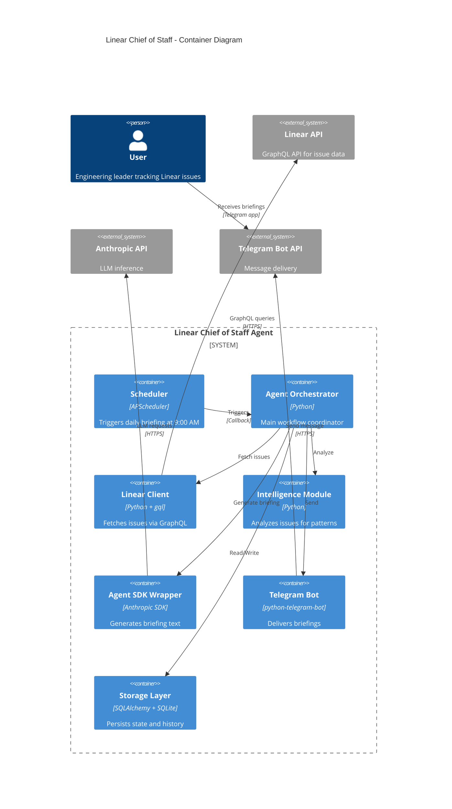

# Components

## Linear API Client

**Responsibility:** Fetch issues from Linear GraphQL API with pagination, rate limiting, and error handling.

**Key Interfaces:**
- `async def fetch_my_issues() -> List[IssueDTO]` - Retrieve all watched/assigned issues
- `async def authenticate() -> UserInfo` - Validate API key and get user info
- `async def get_issue_updates(since: datetime) -> List[IssueDTO]` - Fetch only changed issues

**Dependencies:**
- `httpx` for async HTTP/GraphQL requests (**locked-in decision**)
- `python-decouple` for API key configuration
- `tenacity` for retry logic

**Technology Stack:** Python 3.11, async/await, httpx for hand-written GraphQL queries

**Design Decision:** Using `httpx` with hand-written queries instead of `gql` library or Linear SDK. Rationale: Simpler mocking in tests, fewer runtime dependencies, more control over query structure for a lean monolith.

## Intelligence Module

**Responsibility:** Analyze issues to detect patterns (stagnation, blocking, momentum) using rule-based heuristics.

**Key Interfaces:**
- `class IssueAnalyzer` (abstract base)
  - `def analyze(issues: List[Issue]) -> AnalysisResult`
- `class StagnationAnalyzer(IssueAnalyzer)` - Detects issues with no updates for 3+ days
- `class BlockedIssueDetector(IssueAnalyzer)` - Identifies explicitly blocked issues
- `class ActivityAnalyzer(IssueAnalyzer)` - Finds recently active issues

**Dependencies:**
- Data models (`Issue`)
- Python standard library (`datetime`, `typing`)

**Technology Stack:** Pure Python logic, no external dependencies

## IssueRanker

**Responsibility:** Rank and filter analyzed issues to cap briefing at 3-10 most relevant items (FR14).

**Key Interfaces:**
- `class IssueRanker`
  - `def rank_issues(issues: List[Issue], analysis: AnalysisResult, max_count: int = 10) -> List[Issue]`

**Scoring Algorithm:**
- Blocked issues: 10 points
- Stale issues (no updates 3+ days): 5 points
- Recent activity: 3 points
- Age per week: 1 point
- Final ranking: Issues sorted by total score descending, return top `max_count` items

**Dependencies:**
- `AnalysisResult` from Intelligence Module
- Data models (`Issue`)
- Python standard library (`datetime`, `typing`, `heapq`)

**Technology Stack:** Pure Python logic

## Anthropic Agent SDK Integration

**Responsibility:** Generate natural language briefings from analyzed issue data using LLM reasoning.

**Key Interfaces:**
- `class BriefingAgent` (facade for Agent SDK)
  - `async def generate_briefing(issues: List[Issue], analysis: AnalysisResult) -> BriefingText`
  - `def get_token_usage() -> TokenUsageStats`

**Dependencies:**
- Anthropic Agent SDK (primary)
- Issue data models
- Prompt templates (stored in code or config)

**Technology Stack:** Anthropic Agent SDK, Python 3.11, async/await

**Prompt Length Constraints (FR6):**
- Prompt template MUST enforce 1-2 sentence summaries per issue
- Example instruction: "Summarize each issue in maximum 2 sentences (200 characters). Focus on current status and next action needed."
- **Validation:** Unit tests assert response length <200 chars per issue summary. Test fails if Agent SDK generates longer summaries.
- Fallback: If summary exceeds limit, truncate to 200 chars + "..." (handled in `BriefingAgent._validate_summary_length()`)

## SemanticSearch & Learning Memory

**Responsibility:** Use embeddings and mem0 to learn user preferences and semantically search Linear issues.

**Key Interfaces:**
- `class SemanticIssueIndex`
  - `async def index_issue(issue: Issue) -> None` - Generate and store embedding for issue
  - `async def search_similar(query: str, top_k: int = 10) -> List[Issue]` - Semantic search
- `class PreferenceLearner` (uses mem0)
  - `async def observe_interaction(issue_id: str, action: str)` - Track what user engages with
  - `async def get_user_interests() -> Dict[str, float]` - Retrieve learned preferences (topics, labels, teams)

**Dependencies:**
- `mem0` - Persistent memory layer for agent context and user preferences
- `sentence-transformers` - Generate embeddings for Linear issue content
- `chromadb` or `faiss` - Vector database for similarity search (optional, can use pgvector if migrating to PostgreSQL)

**Technology Stack:** Python, mem0, sentence-transformers (all-MiniLM-L6-v2 model), numpy

**Design Decision:** mem0 replaces custom DB-based agent context. Instead of storing JSON blobs, use mem0's memory graph to track:
- User interaction patterns (which issues get clicked/commented on)
- Topic preferences (backend vs. frontend, features vs. bugs)
- Team/project focus areas
- Historical briefing quality feedback

**Integration with Agent SDK:**
- mem0 context is passed to Agent SDK prompts as "user context"
- Agent uses this to prioritize issues semantically aligned with user interests

## Telegram Bot

**Responsibility:** Deliver briefings to user via Telegram Bot API with message formatting and chunking.

**Key Interfaces:**
- `async def send_briefing(text: str, chat_id: str) -> MessageResult`
- `async def send_chunked_message(text: str, chat_id: str, max_length: int = 4096)`

**Dependencies:**
- `python-telegram-bot` library
- `python-decouple` for bot token
- Telegram Bot API (external)

**Technology Stack:** python-telegram-bot 20.x, async/await

## CostTracker

**Responsibility:** Track and report token usage and Anthropic API costs for learning analysis.

**Key Interfaces:**
- `class CostTracker`
  - `def log_token_usage(tokens: int, operation: str)` - Record token consumption for an operation
  - `def get_daily_cost() -> CostReport` - Retrieve cost metrics for current day with token counts and estimated API costs
  - `def cli_metrics_dashboard() -> str` - Generate formatted metrics dashboard for CLI output

**CLI Command:**
- `python -m linear_chief.cli metrics` - Display token usage and cost dashboard

**Storage:**
- Append to `briefings` table with cost metadata, or separate `cost_logs` table with structure:
  - `id`, `timestamp`, `operation`, `token_count`, `estimated_cost_usd`

**Technology Stack:** Python, SQLite, `rich` library for CLI table formatting

## Storage Layer

**Responsibility:** Persist and retrieve issue states and briefing history using SQLite + SQLAlchemy ORM. Also maintains agent context for continuity across briefing cycles.

**Key Interfaces:**
- `class IssueRepository`
  - `async def save_issues(issues: List[Issue])`
  - `async def get_issues_changed_since(timestamp: datetime) -> List[Issue]`
  - `async def mark_issue_seen(issue_id: str, timestamp: datetime)`
- `class BriefingRepository`
  - `async def save_briefing(briefing: Briefing)`
  - `async def get_recent_briefings(days: int = 7) -> List[Briefing]`
  - `async def save_agent_context(briefing_id: int, context: Dict)` - Store agent memory (last briefing narrative, follow-up flags)

**Agent Context Persistence:**
- **Purpose:** Preserve agent reasoning and follow-up flags across briefing cycles to prevent memory loss from Agent SDK session resets
- **Database Field:** Add `agent_context` JSON column to `briefings` table
- **Contents:** Last briefing narrative, unresolved follow-up flags, contextual notes for next cycle

**Dependencies:**
- SQLAlchemy 2.0+ (async engine)
- SQLite 3.x
- Data models (`Issue`, `Briefing`)

**Technology Stack:** SQLAlchemy (async), SQLite, Python 3.11

## Scheduler

**Responsibility:** Trigger briefing generation at scheduled time (9:00 AM daily in user's local timezone).

**Key Interfaces:**
- `class BriefingScheduler` (concrete implementation, not interface)
  - `def schedule_daily(time: str, timezone: str, callback: Callable)`
  - `def start()`
  - `def stop()`

**Dependencies:**
- **APScheduler 3.10.x** (primary scheduler - LOCKED-IN DECISION)
- `pytz` for timezone handling
- Orchestrator callback function

**Technology Stack:** APScheduler with CronTrigger, Python asyncio

**Design Decision:** APScheduler is the **primary** scheduling mechanism. Anthropic Agent SDK native scheduling (if available) is a **stretch goal** for future optimization, NOT a week-1 requirement. This de-risks the MVP and ensures we can proceed with Epics 2-3 regardless of Agent SDK capabilities.

**Timezone Handling:**
- User configures `LOCAL_TIMEZONE` in `.env` (e.g., "America/New_York", "Europe/Prague")
- Scheduler uses `pytz` to convert to system time
- DST transitions handled automatically by pytz
- Test suite includes DST boundary test cases

**Contingency Plan (if Agent SDK spike fails):**
- Fallback: Use APScheduler + plain Claude Messages API (not Agent SDK)
- Cron wrapper alternative: systemd timer + Python script
- Both options validated in Week 1 spike

## Component Diagrams

---
