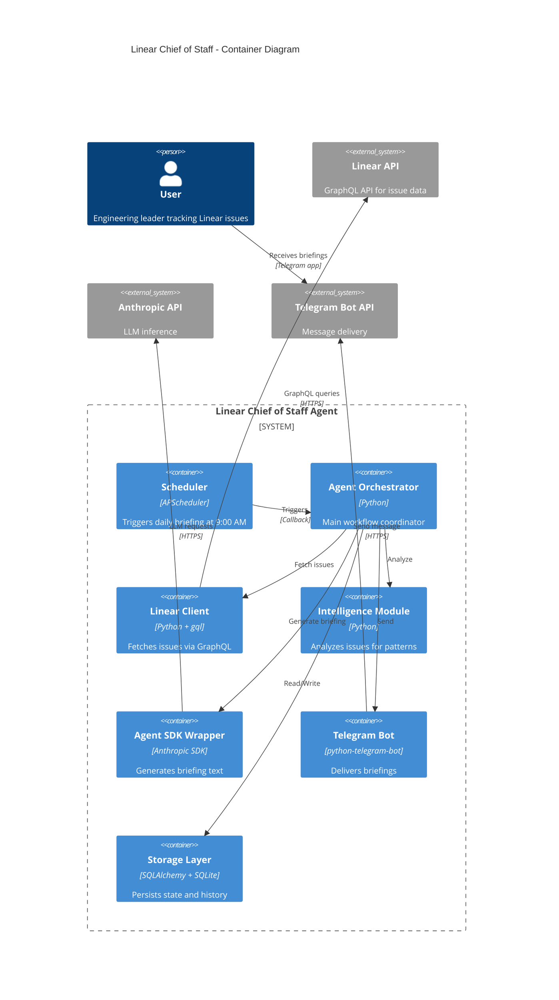

# Components

## Linear API Client

**Responsibility:** Fetch issues from Linear GraphQL API with pagination, rate limiting, and error handling.

**Key Interfaces:**
- `async def fetch_my_issues() -> List[IssueDTO]` - Retrieve all watched/assigned issues
- `async def authenticate() -> UserInfo` - Validate API key and get user info
- `async def get_issue_updates(since: datetime) -> List[IssueDTO]` - Fetch only changed issues

**Dependencies:**
- `httpx` for async HTTP/GraphQL requests (**locked-in decision**)
- `python-decouple` for API key configuration
- `tenacity` for retry logic

**Technology Stack:** Python 3.11, async/await, httpx for hand-written GraphQL queries

**Design Decision:** Using `httpx` with hand-written queries instead of `gql` library or Linear SDK. Rationale: Simpler mocking in tests, fewer runtime dependencies, more control over query structure for a lean monolith.

## Intelligence Module

**Responsibility:** Analyze issues to detect patterns (stagnation, blocking, momentum) using rule-based heuristics.

**Key Interfaces:**
- `class IssueAnalyzer` (abstract base)
  - `def analyze(issues: List[Issue]) -> AnalysisResult`
- `class StagnationAnalyzer(IssueAnalyzer)` - Detects issues with no updates for 3+ days
- `class BlockedIssueDetector(IssueAnalyzer)` - Identifies explicitly blocked issues
- `class ActivityAnalyzer(IssueAnalyzer)` - Finds recently active issues

**Dependencies:**
- Data models (`Issue`)
- Python standard library (`datetime`, `typing`)

**Technology Stack:** Pure Python logic, no external dependencies

## IssueRanker

**Responsibility:** Rank and filter analyzed issues to cap briefing at 3-10 most relevant items (FR14).

**Key Interfaces:**
- `class IssueRanker`
  - `def rank_issues(issues: List[Issue], analysis: AnalysisResult, max_count: int = 10) -> List[Issue]`

**Scoring Algorithm:**
- Blocked issues: 10 points
- Stale issues (no updates 3+ days): 5 points
- Recent activity: 3 points
- Age per week: 1 point
- Final ranking: Issues sorted by total score descending, return top `max_count` items

**Dependencies:**
- `AnalysisResult` from Intelligence Module
- Data models (`Issue`)
- Python standard library (`datetime`, `typing`, `heapq`)

**Technology Stack:** Pure Python logic

## Anthropic Agent SDK Integration

**Responsibility:** Generate natural language briefings from analyzed issue data using LLM reasoning with access to agent memory and user preferences. **EXPLICITLY NOT RESPONSIBLE FOR:** Scheduling (handled by APScheduler).

**Key Interfaces:**
- `class BriefingAgent`
  - `async def generate_briefing(issues: List[Issue], analysis: AnalysisResult, context: AgentMemory) -> BriefingText`
  - `def get_token_usage() -> TokenUsageStats`

**Dependencies:**
- Anthropic Agent SDK (**locked-in decision**)
- mem0 for persistent agent memory
- Issue data models
- Prompt templates (stored in `docs/prompts/`)

**Technology Stack:** Anthropic Agent SDK, Python 3.11, async/await

**Architecture Decision:** Agent SDK is the **PRIMARY and ONLY** LLM integration. No fallback mechanisms, no Messages API alternative. This decision is final.

**Rationale:**
- Agent SDK provides autonomous reasoning capabilities needed for intelligent briefing generation
- Built-in memory management and tool integration align with project goals
- Learning objective requires hands-on Agent SDK experience

**Prompt Configuration:**
- Prompt template enforces concise summaries (1-2 sentences per issue)
- Example instruction: "Summarize each issue in maximum 2 sentences. Focus on current status and next action needed."
- Agent receives context from mem0: previous briefings, user preferences, conversation history

## Memory & Learning System

**Responsibility:** Persistent agent memory, user preference learning, and semantic search using mem0 and ChromaDB. Enables the agent to remember context, learn from interactions, and personalize briefings.

**Key Interfaces:**
- `class AgentMemory` (wraps mem0)
  - `async def save_briefing_context(briefing: Briefing, narrative: str) -> None` - Store briefing narrative
  - `async def get_recent_context(days: int = 7) -> List[BriefingContext]` - Retrieve agent's recent memory
  - `async def observe_interaction(issue_id: str, action: str, context: Dict) -> None` - Track user engagement
  - `async def get_user_preferences() -> UserPreferences` - Retrieve learned preferences

- `class SemanticSearch`
  - `async def index_issue(issue: Issue) -> None` - Generate and store embedding
  - `async def find_similar(query: str, top_k: int = 10) -> List[Issue]` - Semantic similarity search
  - `async def find_related(issue_id: str) -> List[Issue]` - Find related issues

**Dependencies:**
- `mem0` - Persistent memory layer (**locked-in decision**)
- `sentence-transformers` - Embedding generation (all-MiniLM-L6-v2 model)
- `chromadb` - Vector database for similarity search
- SQLite - Backup storage for feedback data

**Technology Stack:** mem0, sentence-transformers, ChromaDB, Python 3.11

**Core Capabilities:**

1. **Agent Context Memory:**
   - Stores last 7 days of briefing narratives in mem0
   - Enables continuity: "Yesterday I flagged ENG-123 as stale, today it's STILL stale → escalate"
   - Tracks unresolved follow-ups and action items

2. **User Preference Learning:**
   - Topic preferences: backend (40%), API (30%), frontend (20%), infra (10%)
   - Team engagement: most active with @api-team, @backend-team
   - Label priorities: "security" and "performance" prioritized over "nice-to-have"
   - Implicit learning from interaction patterns

3. **Semantic Search:**
   - Find similar issues based on content embeddings
   - Cluster related issues automatically
   - Detect potential duplicates
   - Support queries like "Show me issues like ENG-123"

4. **Feedback Tracking:**
   - Telegram inline buttons (👍/👎) per issue
   - Read receipts: which issues user opened in Linear
   - Conversation history for multi-turn dialogues
   - Refines relevance scoring based on feedback

**Integration with Agent SDK:**
- mem0 context passed to Agent SDK as system prompt
- Agent uses preferences to re-rank IssueRanker output
- Agent tailors language based on user history (technical vs. managerial tone)
- Agent remembers unresolved follow-ups: "Last week you asked about X, here's the update"

**Data Storage:**
- mem0: Stores memory graph with timestamps and relationships
- ChromaDB: Stores issue embeddings (384-dim vectors)
- SQLite: Backup for feedback ratings (`issue_feedback` table)

**Configuration:**
- `MEM0_API_KEY` - mem0 API key (if using hosted) or local mode
- `CHROMADB_PATH` - ChromaDB persistence directory (default: `~/.linear_chief/chromadb`)
- `EMBEDDING_MODEL` - sentence-transformers model (default: `all-MiniLM-L6-v2`)

## Telegram Bot

**Responsibility:** Deliver briefings to user via Telegram Bot API with message formatting and chunking.

**Key Interfaces:**
- `async def send_briefing(text: str, chat_id: str) -> MessageResult`
- `async def send_chunked_message(text: str, chat_id: str, max_length: int = 4096)`

**Dependencies:**
- `python-telegram-bot` library
- `python-decouple` for bot token
- Telegram Bot API (external)

**Technology Stack:** python-telegram-bot 20.x, async/await

## CostTracker

**Responsibility:** Track and report token usage and Anthropic API costs for learning analysis.

**Key Interfaces:**
- `class CostTracker`
  - `def log_token_usage(tokens: int, operation: str)` - Record token consumption for an operation
  - `def get_daily_cost() -> CostReport` - Retrieve cost metrics for current day with token counts and estimated API costs
  - `def cli_metrics_dashboard() -> str` - Generate formatted metrics dashboard for CLI output

**CLI Command:**
- `python -m linear_chief.cli metrics` - Display token usage and cost dashboard

**Storage:**
- Append to `briefings` table with cost metadata, or separate `cost_logs` table with structure:
  - `id`, `timestamp`, `operation`, `token_count`, `estimated_cost_usd`

**Technology Stack:** Python, SQLite, `rich` library for CLI table formatting

## Storage Layer

**Responsibility:** Persist and retrieve issue states and briefing history using SQLite + SQLAlchemy ORM. Also maintains agent context for continuity across briefing cycles.

**Key Interfaces:**
- `class IssueRepository`
  - `async def save_issues(issues: List[Issue])`
  - `async def get_issues_changed_since(timestamp: datetime) -> List[Issue]`
  - `async def mark_issue_seen(issue_id: str, timestamp: datetime)`
- `class BriefingRepository`
  - `async def save_briefing(briefing: Briefing)`
  - `async def get_recent_briefings(days: int = 7) -> List[Briefing]`
  - `async def save_agent_context(briefing_id: int, context: Dict)` - Store agent memory (last briefing narrative, follow-up flags)

**Agent Context Persistence:**
- **Purpose:** Preserve agent reasoning and follow-up flags across briefing cycles to prevent memory loss from Agent SDK session resets
- **Database Field:** Add `agent_context` JSON column to `briefings` table
- **Contents:** Last briefing narrative, unresolved follow-up flags, contextual notes for next cycle

**Dependencies:**
- SQLAlchemy 2.0+ (async engine)
- SQLite 3.x
- Data models (`Issue`, `Briefing`)

**Technology Stack:** SQLAlchemy (async), SQLite, Python 3.11

## Scheduler

**Responsibility:** Trigger briefing generation at scheduled time (9:00 AM daily in user's local timezone).

**Key Interfaces:**
- `class BriefingScheduler` (concrete implementation, not interface)
  - `def schedule_daily(time: str, timezone: str, callback: Callable)`
  - `def start()`
  - `def stop()`

**Dependencies:**
- **APScheduler 3.10.x** (primary scheduler - LOCKED-IN DECISION)
- `pytz` for timezone handling
- Orchestrator callback function

**Technology Stack:** APScheduler with CronTrigger, Python asyncio

**Architecture Decision:** APScheduler is the **ONLY** scheduling mechanism for MVP. Agent SDK (if used) is **strictly for inference/reasoning**, NOT for scheduling or orchestration. This eliminates architectural ambiguity and de-risks the MVP.

**Rationale:**
- APScheduler is proven, well-documented, and fits the use case perfectly
- Anthropic Agent SDK's scheduling capabilities (if any) are unvalidated and add unnecessary risk
- Separation of concerns: scheduling logic is independent of LLM inference

**Timezone Handling:**
- User configures `LOCAL_TIMEZONE` in `.env` (e.g., "America/New_York", "Europe/Prague")
- Scheduler uses `pytz` to convert to system time
- DST transitions handled automatically by pytz
- Test suite includes DST boundary test cases

**No Contingency Plan Needed:** APScheduler is the locked-in choice. If performance/features are inadequate (highly unlikely), fallback to systemd timer + Python script is trivial.

## Component Diagrams

---
