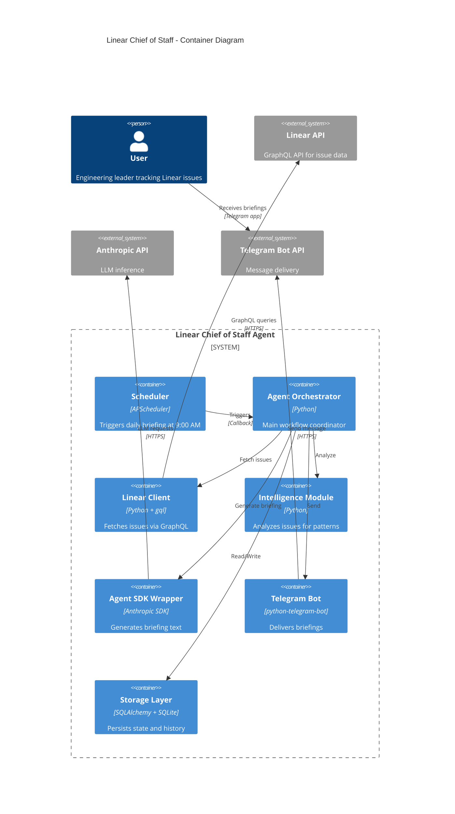

# Components

## Linear API Client

**Responsibility:** Fetch issues from Linear GraphQL API with pagination, rate limiting, and error handling.

**Key Interfaces:**
- `async def fetch_my_issues() -> List[IssueDTO]` - Retrieve all watched/assigned issues
- `async def authenticate() -> UserInfo` - Validate API key and get user info
- `async def get_issue_updates(since: datetime) -> List[IssueDTO]` - Fetch only changed issues

**Dependencies:**
- `httpx` for async HTTP/GraphQL requests (**locked-in decision**)
- `python-decouple` for API key configuration
- `tenacity` for retry logic

**Technology Stack:** Python 3.11, async/await, httpx for hand-written GraphQL queries

**Design Decision:** Using `httpx` with hand-written queries instead of `gql` library or Linear SDK. Rationale: Simpler mocking in tests, fewer runtime dependencies, more control over query structure for a lean monolith.

## Intelligence Module

**Responsibility:** Analyze issues to detect patterns (stagnation, blocking, momentum) using rule-based heuristics.

**Key Interfaces:**
- `class IssueAnalyzer` (abstract base)
  - `def analyze(issues: List[Issue]) -> AnalysisResult`
- `class StagnationAnalyzer(IssueAnalyzer)` - Detects issues with no updates for 3+ days
- `class BlockedIssueDetector(IssueAnalyzer)` - Identifies explicitly blocked issues
- `class ActivityAnalyzer(IssueAnalyzer)` - Finds recently active issues

**Dependencies:**
- Data models (`Issue`)
- Python standard library (`datetime`, `typing`)

**Technology Stack:** Pure Python logic, no external dependencies

## IssueRanker

**Responsibility:** Rank and filter analyzed issues to cap briefing at 3-10 most relevant items (FR14).

**Key Interfaces:**
- `class IssueRanker`
  - `def rank_issues(issues: List[Issue], analysis: AnalysisResult, max_count: int = 10) -> List[Issue]`

**Scoring Algorithm:**
- Blocked issues: 10 points
- Stale issues (no updates 3+ days): 5 points
- Recent activity: 3 points
- Age per week: 1 point
- Final ranking: Issues sorted by total score descending, return top `max_count` items

**Dependencies:**
- `AnalysisResult` from Intelligence Module
- Data models (`Issue`)
- Python standard library (`datetime`, `typing`, `heapq`)

**Technology Stack:** Pure Python logic

## Anthropic Agent SDK Integration

**Responsibility:** Generate natural language briefings from analyzed issue data using LLM reasoning. **EXPLICITLY NOT RESPONSIBLE FOR:** Scheduling (handled by APScheduler), long-term memory persistence (handled by SQLite + mem0).

**Key Interfaces:**
- `class BriefingAgent` (facade for Agent SDK or plain Claude Messages API)
  - `async def generate_briefing(issues: List[Issue], analysis: AnalysisResult) -> BriefingText`
  - `def get_token_usage() -> TokenUsageStats`

**Dependencies:**
- Anthropic Claude Messages API (primary) OR Anthropic Agent SDK (if Week 1 spike validates added value)
- Issue data models
- Prompt templates (stored in code or config)

**Technology Stack:** Anthropic Claude (Messages API), Python 3.11, async/await

**Architecture Decision:** Agent SDK is **OPTIONAL** for MVP. Week 1 spike validates if SDK provides value over plain Claude Messages API.

**Fallback Strategy (if Agent SDK inadequate):**
1. **Detection Trigger:**
   - Startup health check: Test prompt fails or times out (>30s)
   - Runtime detection: 3 consecutive API failures
   - Cost spike: Token usage >2x expected baseline

2. **Automatic Fallback:**
   - Switch `BriefingAgent` implementation from `AgentSDKBriefing` to `MessagesAPIBriefing`
   - Both implement same interface: `async def generate_briefing(issues, analysis) -> BriefingText`
   - No orchestrator changes required (interface abstraction)

3. **Implementation:**
   ```python
   # Factory pattern for agent selection
   def create_briefing_agent(config):
       if config.USE_AGENT_SDK and agent_sdk_health_check():
           return AgentSDKBriefingAgent()
       else:
           logger.warning("Falling back to Messages API")
           return MessagesAPIBriefingAgent()
   ```

**Configuration:**
- `USE_AGENT_SDK` - Boolean flag in .env (default: True, auto-fallback to False on errors)
- `AGENT_SDK_TIMEOUT` - Health check timeout (default: 30s)

**No Risk:** Both paths tested in Week 1 spike. Fallback is seamless due to interface abstraction.

**Prompt Length Constraints (FR6):**
- Prompt template MUST enforce 1-2 sentence summaries per issue
- Example instruction: "Summarize each issue in maximum 2 sentences (200 characters). Focus on current status and next action needed."
- **Validation:** Unit tests assert response length <200 chars per issue summary. Test fails if Agent SDK generates longer summaries.
- Fallback: If summary exceeds limit, truncate to 200 chars + "..." (handled in `BriefingAgent._validate_summary_length()`)

## Agent Context Memory (MVP Scope)

**Responsibility:** **MVP ONLY** - Basic agent context persistence for briefing continuity. No preference learning, no semantic search, no feedback tracking. These are Phase 2+ features.

**Key Interfaces:**
- `class AgentContextManager`
  - `async def save_briefing_context(briefing_id: int, context: Dict) -> None` - Store last briefing narrative
  - `async def get_recent_context(days: int = 7) -> List[Dict]` - Retrieve recent briefing contexts

**MVP Scope (Week 1-4):**
- **ONLY Agent Context Memory:** Last 7 days of briefing summaries stored in SQLite `briefings.agent_context` JSON column
- **Purpose:** Enable continuity ("ENG-123 was flagged yesterday as stale, today it's STILL stale")
- **No machine learning, no embeddings, no preference tracking**

**Dependencies (MVP):**
- SQLite (existing) - stores context in `briefings` table `agent_context` JSON field
- No additional libraries needed

**Technology Stack:** Pure Python + SQLite, no ML dependencies

**Phase 2+ Features (OUT OF MVP SCOPE):**
The following features are **explicitly deferred** to Phase 2-3:

1. **User Preference Learning (Phase 2):**
   - Topic preferences (backend vs. frontend)
   - Team/label prioritization
   - Historical engagement patterns
   - **Dependencies:** mem0 or custom preference store

2. **Semantic Search (Phase 2):**
   - Embeddings for issue similarity
   - Related issue detection
   - Duplicate flagging
   - **Dependencies:** sentence-transformers, ChromaDB

3. **Feedback Tracking (Phase 2):**
   - Telegram inline buttons (👍/👎)
   - Feedback-driven ranking adjustments
   - **Dependencies:** Bidirectional Telegram bot

4. **Advanced Context (Phase 3):**
   - Conversation history across multiple turns
   - Read receipt tracking
   - Implicit feedback from user behavior

**Rationale for MVP Reduction:**
- Embedding/vector search adds significant complexity (ChromaDB, model management)
- Preference learning requires data collection period (no data on Day 1)
- Feedback tracking requires Phase 2 bidirectional Telegram (not MVP)
- **MVP goal:** Validate core workflow (fetch → analyze → brief) with minimal dependencies

**Migration Path to Phase 2:**
When ready for preference learning:
1. Add `mem0` or custom preference store
2. Implement `PreferenceLearner` class
3. Integrate sentence-transformers for embeddings
4. Deploy ChromaDB for vector search
5. Update `IssueRanker` to incorporate learned preferences

## Telegram Bot

**Responsibility:** Deliver briefings to user via Telegram Bot API with message formatting and chunking.

**Key Interfaces:**
- `async def send_briefing(text: str, chat_id: str) -> MessageResult`
- `async def send_chunked_message(text: str, chat_id: str, max_length: int = 4096)`

**Dependencies:**
- `python-telegram-bot` library
- `python-decouple` for bot token
- Telegram Bot API (external)

**Technology Stack:** python-telegram-bot 20.x, async/await

## CostTracker

**Responsibility:** Track and report token usage and Anthropic API costs for learning analysis.

**Key Interfaces:**
- `class CostTracker`
  - `def log_token_usage(tokens: int, operation: str)` - Record token consumption for an operation
  - `def get_daily_cost() -> CostReport` - Retrieve cost metrics for current day with token counts and estimated API costs
  - `def cli_metrics_dashboard() -> str` - Generate formatted metrics dashboard for CLI output

**CLI Command:**
- `python -m linear_chief.cli metrics` - Display token usage and cost dashboard

**Storage:**
- Append to `briefings` table with cost metadata, or separate `cost_logs` table with structure:
  - `id`, `timestamp`, `operation`, `token_count`, `estimated_cost_usd`

**Technology Stack:** Python, SQLite, `rich` library for CLI table formatting

## Storage Layer

**Responsibility:** Persist and retrieve issue states and briefing history using SQLite + SQLAlchemy ORM. Also maintains agent context for continuity across briefing cycles.

**Key Interfaces:**
- `class IssueRepository`
  - `async def save_issues(issues: List[Issue])`
  - `async def get_issues_changed_since(timestamp: datetime) -> List[Issue]`
  - `async def mark_issue_seen(issue_id: str, timestamp: datetime)`
- `class BriefingRepository`
  - `async def save_briefing(briefing: Briefing)`
  - `async def get_recent_briefings(days: int = 7) -> List[Briefing]`
  - `async def save_agent_context(briefing_id: int, context: Dict)` - Store agent memory (last briefing narrative, follow-up flags)

**Agent Context Persistence:**
- **Purpose:** Preserve agent reasoning and follow-up flags across briefing cycles to prevent memory loss from Agent SDK session resets
- **Database Field:** Add `agent_context` JSON column to `briefings` table
- **Contents:** Last briefing narrative, unresolved follow-up flags, contextual notes for next cycle

**Dependencies:**
- SQLAlchemy 2.0+ (async engine)
- SQLite 3.x
- Data models (`Issue`, `Briefing`)

**Technology Stack:** SQLAlchemy (async), SQLite, Python 3.11

## Scheduler

**Responsibility:** Trigger briefing generation at scheduled time (9:00 AM daily in user's local timezone).

**Key Interfaces:**
- `class BriefingScheduler` (concrete implementation, not interface)
  - `def schedule_daily(time: str, timezone: str, callback: Callable)`
  - `def start()`
  - `def stop()`

**Dependencies:**
- **APScheduler 3.10.x** (primary scheduler - LOCKED-IN DECISION)
- `pytz` for timezone handling
- Orchestrator callback function

**Technology Stack:** APScheduler with CronTrigger, Python asyncio

**Architecture Decision:** APScheduler is the **ONLY** scheduling mechanism for MVP. Agent SDK (if used) is **strictly for inference/reasoning**, NOT for scheduling or orchestration. This eliminates architectural ambiguity and de-risks the MVP.

**Rationale:**
- APScheduler is proven, well-documented, and fits the use case perfectly
- Anthropic Agent SDK's scheduling capabilities (if any) are unvalidated and add unnecessary risk
- Separation of concerns: scheduling logic is independent of LLM inference

**Timezone Handling:**
- User configures `LOCAL_TIMEZONE` in `.env` (e.g., "America/New_York", "Europe/Prague")
- Scheduler uses `pytz` to convert to system time
- DST transitions handled automatically by pytz
- Test suite includes DST boundary test cases

**No Contingency Plan Needed:** APScheduler is the locked-in choice. If performance/features are inadequate (highly unlikely), fallback to systemd timer + Python script is trivial.

## Component Diagrams



---
