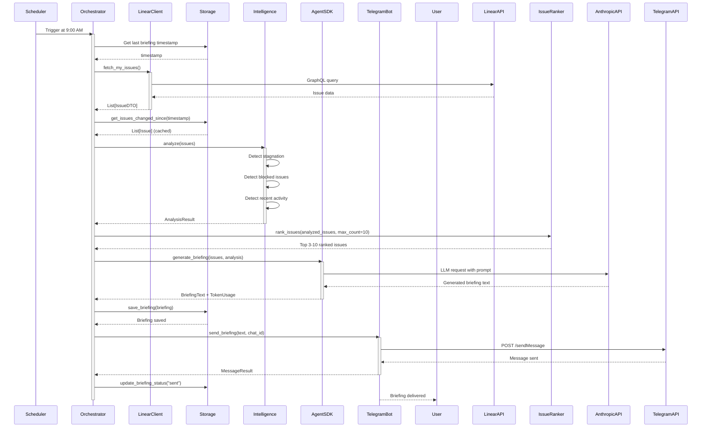
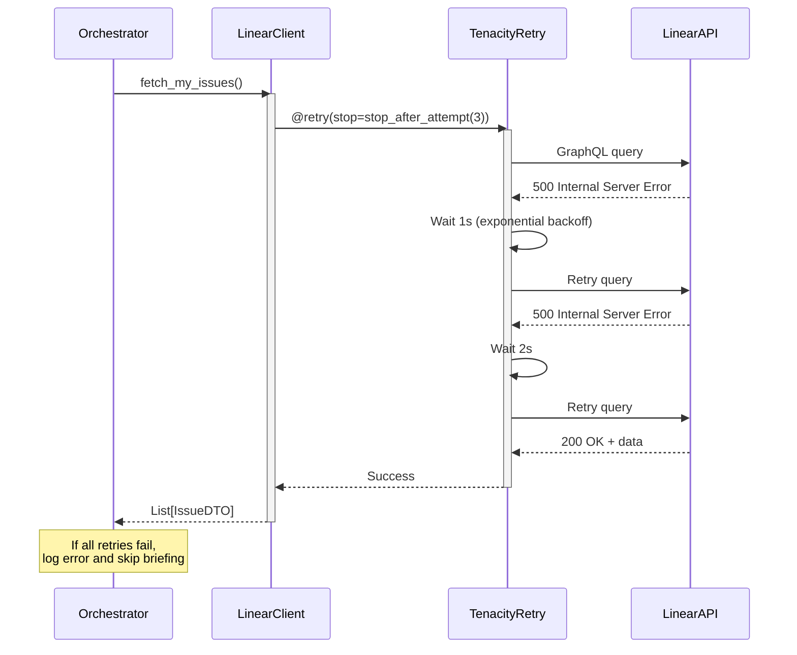

# Core Workflows

## Daily Briefing Generation Workflow

## Error Handling in API Calls

## Workflow Optimization

**Optimization (Epic 3.3):** Workflow uses `get_issues_changed_since(last_briefing_timestamp)` to fetch only changed issues from storage, reducing token consumption. Only delta issues are sent to Agent SDK, not full 50-issue list.

---
