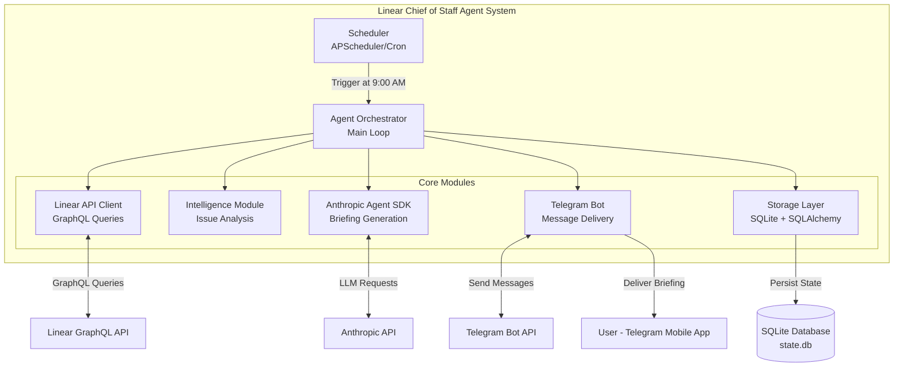

# High Level Architecture

## Technical Summary

Linear Chief of Staff is a **monolithic Python agent system** built on Anthropic's Agent SDK for autonomous monitoring and intelligence briefing generation. The system runs as a single async Python process that periodically fetches Linear issues via GraphQL API, analyzes them using LLM reasoning, and delivers structured briefings via Telegram. State persistence uses SQLite for issue tracking and briefing history. The architecture emphasizes **learning and experimentation** over production-scale optimization, with focus on understanding Agent SDK patterns, cost modeling, and autonomous operation.

## High Level Overview

**Architecture Style:** Monolithic Python Agent System
**Repository:** Monorepo (single repo for all code, docs, and config)
**Deployment:** Local development first, future cloud deployment via systemd service

**Core Flow:**
1. **Scheduler** triggers briefing generation at 9:00 AM daily (APScheduler or Agent SDK native)
2. **Linear Client** fetches watched/assigned issues via GraphQL API
3. **Intelligence Module** analyzes issues for stagnation, blocking, and activity patterns
4. **Agent SDK** generates natural language briefing with issue summaries
5. **Telegram Bot** delivers briefing to user's Telegram chat
6. **Storage Layer** persists issue states and briefing history in SQLite

**Key Architectural Decisions:**
- **Monolith over microservices:** Single-user learning project doesn't warrant distributed complexity
- **SQLite over PostgreSQL:** File-based DB simplifies local development and deployment
- **Async/await:** Python asyncio for concurrent API calls without threading complexity
- **Agent SDK as orchestrator:** Primary intelligence layer, not just an API wrapper
- **Local-first:** Run on local machine before cloud deployment to accelerate learning

## High Level Project Diagram

## Architectural and Design Patterns

- **Repository Pattern:** Abstract SQLite data access behind clean interfaces - _Rationale:_ Enables testing with mock repos and future database migration if needed
- **Async/Await Pattern:** Python asyncio for non-blocking I/O - _Rationale:_ Concurrent API calls (Linear + Anthropic + Telegram) without thread complexity
- **Retry with Exponential Backoff:** Use `tenacity` library for resilient API calls - _Rationale:_ Handle transient failures gracefully without manual retry logic
- **Strategy Pattern for Scheduling:** Abstract scheduler interface (APScheduler or Agent SDK native) - _Rationale:_ Week 1 spike will determine best approach, design supports both
- **Facade Pattern for Agent SDK:** Wrap Agent SDK calls behind `BriefingAgent` interface - _Rationale:_ Isolate SDK-specific details, simplify testing with mocks
- **Template Method for Intelligence Analysis:** Base `IssueAnalyzer` with concrete implementations (`StagnationAnalyzer`, `BlockedIssueDetector`) - _Rationale:_ Extensible analysis logic without modifying orchestrator

---
